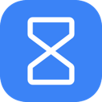

 

# TickTab

A smart browser extension that automatically closes inactive tabs to save memory and keep your browser clean. 
Unlike many other extensions, TickTab survives browser restarts by carefully tracking URL activity in the local storage.

## Features
- **Auto-Close Inactive Tabs**: Choose an expiration time ranging from 1 minute up to several weeks, using standard presets or precise custom units (Minutes, Hours, Days, Weeks).
- **Management Popup**: Real-time visualization of how long each open tab has been inactive.
- **Sorting Options**: Toggle between ascending (oldest first) and descending (newest first) tab sorting in the popup.
- **Smart Nuke**: Instantly close all inactive tabs with one click while keeping your media and pinned tabs safe.
- **Master Toggle**: Easily disable or enable the extension at any time via the options page.
- **Smart Exceptions**:
  - Pinned tabs are ignored.
  - The currently active tab in any window is secure.
  - Tabs playing audio or video (e.g., Spotify, YouTube, Netflix) are ignored.
- **Restart Resilient**: TickTab uses `chrome.alarms` and persistent storage to reliably track tab inactivity even if you constantly close and reopen your browser.

## Installation

You have three options to install TickTab:

**1. [Chrome Web Store](https://chromewebstore.google.com/detail/ticktab-auto-close/icmobmhlapkebikcojedmmcfpohldknl)**

**2. [Microsoft Edge Add-ons](https://microsoftedge.microsoft.com/addons/detail/ticktab-auto-close/moklapfaggndgdolfccinjiccbklmdhg)**

**3. Manual Installation (Unpacked)**
1. Clone this repository or download the ZIP and extract it.
2. Open Chrome/Edge and navigate to `chrome://extensions` or `edge://extensions`.
3. Enable **Developer mode** in the top right corner.
4. Click **Load unpacked** and select the src folder.

## Usage & Settings
Once installed, click on the **TickTab** icon in the extensions toolbar to open the settings menu. You can customize the expiration time there.

## Privacy
TickTab operates 100% locally on your machine. It does not send any of your browsing data, URLs, or activity to any external server. 
